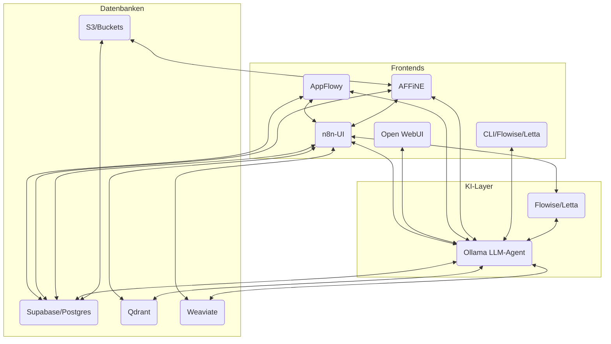

# Architekturüberblick

Diese Datei fasst die geplante Architektur eines selbstgehosteten Knowledge Hubs zusammen. AppFlowy und AFFiNE dienen als bidirektional vernetzte Knowledge Hubs. n8n orchestriert den Datenaustausch zwischen allen Komponenten und ein lokaler LLM-Agent stellt per RAG Funktionalität bereit.

## Kernkomponenten

- **Supabase (PostgreSQL)** – zentrale Datenbank mit `pgvector` und S3 Storage.
- **Qdrant** und **Weaviate** – Vektor-Datenbanken zur semantischen Suche.
- **AppFlowy** und **AFFiNE** – Wissensfrontends mit PostgreSQL-Backend.
- **n8n** – Integrations- und Automatisierungsplattform.
- **Ollama LLM-Agent** – lokaler LLM für Retrieval-Augmented Generation.

## Datenflüsse

1. Neue Inhalte in AppFlowy oder AFFiNE lösen Workflows in n8n aus.
2. n8n erzeugt Embeddings mittels Ollama und speichert sie in Qdrant bzw. Weaviate.
3. Änderungen werden in Supabase gespiegelt und optional in andere Systeme synchronisiert.
4. Der LLM-Agent nutzt die Vektor-Datenbanken für semantische Anfragen aus allen Frontends.

## Sicherheit und Monitoring

- Zentrale Authentifizierung über Supabase oder die nativen Systeme.
- Caddy reverse proxy bietet HTTPS für alle Dienste.
- Prometheus und Grafana überwachen die Umgebung.

## Visualisierung

Diese Architektur ermöglicht eine erweiterbare Self‑Hosted‑Platform, die Daten aus allen Quellen zusammenführt und über den LLM-Agenten kontextbezogen bereitstellt.
